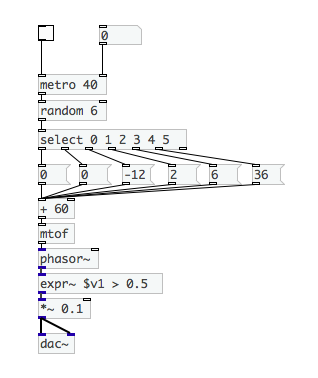
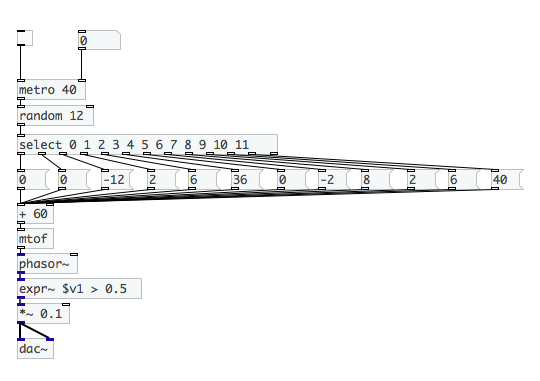

# List externals

For generative music lists are simpler and more effective then manipulating single values.

This tutorial covers all basic lists manipulation in CEAMMC library.

## [list.choice]

Let's try to make 8-bit random generator using vanilla objects and CEAMMC objects.
For example, we don't need all random notes, we have some scale and want to use
notes only from this scale.

### vanilla version

_(click on images to download Pd patch)_

It's simple, but what if we want to add some values to scale live?
It will require some time and patching. We need:

- add new change ![[random]](obj/random.png) limit to other value
- change ![[select]](obj/select.png) values
- make new message boxes and connect them to ![[mtof]](obj/mtof.png) object

So it's take time to get result like this:

As you can see every scale change requires a lot of manipulations: doing connections and
objects creating/modification.

But if we will use lists the things are much simple, we just to need pick random element
from list. And there is object for this task: . Every time it receives list,
it outputs random element from it. So live scale change only require to change
list itself.

Here's list version with CEAMMC objects:

### list version

